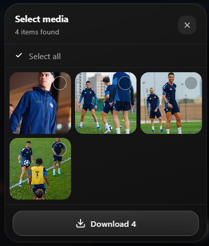

# IG Downloader


A minimal Chrome extension to download photos and videos from Instagram — posts, reels, carousels, stories and highlights.

> Click the extension icon while viewing any Instagram content to download it.

---

## Preview



---

## Features

- **Posts & Reels** — download photos and videos directly
- **Carousels** — pick individual items from a visual selector
- **Stories & Highlights** — download all story media
- **Minimal UI** — toast notifications and a glassmorphic media picker, no popups

---

## Installation

1. Clone or download this repository
2. Open Chrome and go to `chrome://extensions/`
3. Enable **Developer mode** (top right toggle)
4. Click **Load unpacked** and select the project folder
5. Done — pin the extension for easy access

---

## Usage

| Page | Action |
|------|--------|
| Post or Reel | Click the icon → downloads immediately |
| Carousel (multiple photos/videos) | Click the icon → picker appears, select items → Download |
| Story / Highlight | Click the icon → downloads all story media |

---

## Project Structure

```
├── manifest.json
├── icons/
└── src/
    ├── js/
    │   ├── background.js   # Service worker — listens for icon clicks
    │   ├── main.js         # Entry point — URL detection & download routing
    │   ├── post.js         # Instagram post/reel API
    │   ├── story.js        # Instagram story/highlight API
    │   ├── utils.js        # Fetch, save, and toast helpers
    │   ├── toast.js        # Sileo-inspired toast notification system
    │   └── picker.js       # Glassmorphic media selection panel
    └── style/
        ├── toast.css
        └── picker.css
```

---

## Permissions

This extension requests only what it needs:

- `downloads` — to save files to your Downloads folder
- `activeTab` — to read the current Instagram page
- Access to `instagram.com` — to fetch media URLs from the page context

No data is collected, stored, or transmitted anywhere.


## Disclaimer

This project is intended for **personal use only** — to download content you own or have the right to save. Please respect creators' work and Instagram's [Terms of Service](https://help.instagram.com/581066165581870). The author is not responsible for any misuse.

---

## License

MIT